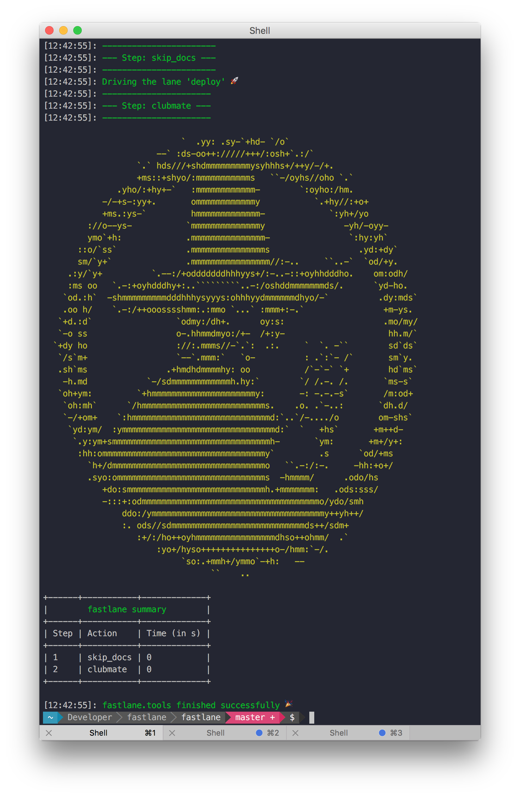

# fastlane-plugin-clubmate `fastlane` Plugin

[](https://rubygems.org/gems/fastlane-plugin-clubmate)

## Getting Started

This project is a [fastlane](https://github.com/fastlane/fastlane) plugin. To get started with fastlane-plugin-clubmate, add it to your project by running:

```bash
fastlane add_plugin clubmate
```

## About clubmate

Print a Club Mate in your build output



## Issues and Feedback

For any other issues and feedback about this plugin, please submit it to this repository.

## Troubleshooting

For some more detailed help with plugins problems, check out the [Plugins Troubleshooting](https://github.com/fastlane/fastlane/blob/master/fastlane/docs/PluginsTroubleshooting.md) doc in the main `fastlane` repo.

## Using `fastlane` Plugins

For more information about how the `fastlane` plugin system works, check out the [Plugins documentation](https://github.com/fastlane/fastlane/blob/master/fastlane/docs/Plugins.md) in the main `fastlane` repo.

## About `fastlane`

`fastlane` automates building, testing, and releasing your app for beta and app store distributions. To learn more about `fastlane`, check out [fastlane.tools](https://fastlane.tools).
